<div align="center">

# DevSecOps Banking Application

A high-performance, containerized financial platform built with Spring Boot 3, Java 21, and integrated Contextual AI. This project implements a secure "Golden Pipeline" using GitHub Actions, OIDC authentication, and AWS managed services.

[](https://www.oracle.com/java/technologies/javase/jdk21-archive-downloads.html)
[](https://spring.io/projects/spring-boot)
[](.github/workflows/devsecops.yml)
[](#phase-3-security-and-identity-configuration)

</div>

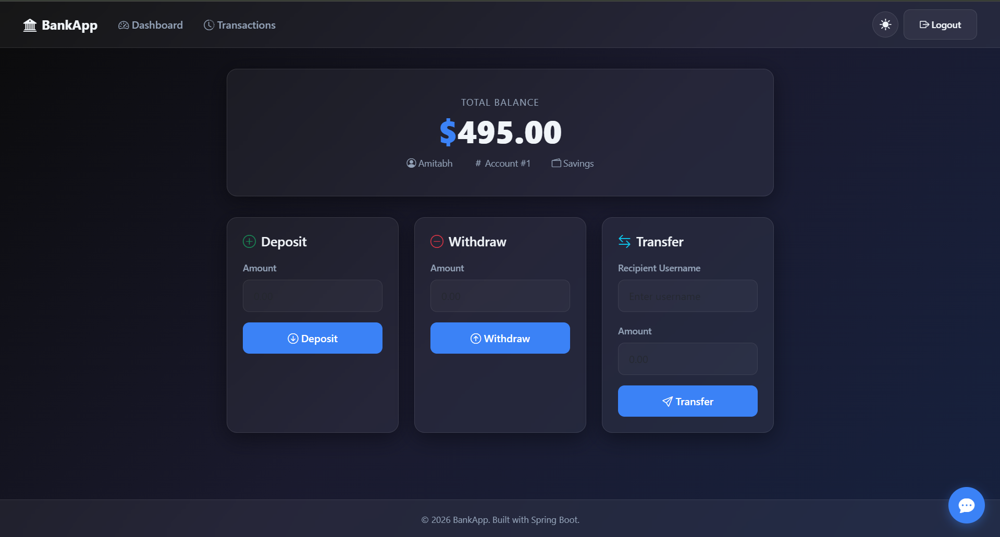

---

## Technical Architecture

The application is deployed across a multi-tier, segmented AWS environment. The control plane leverages GitHub Actions for automated builds and secure deployments.

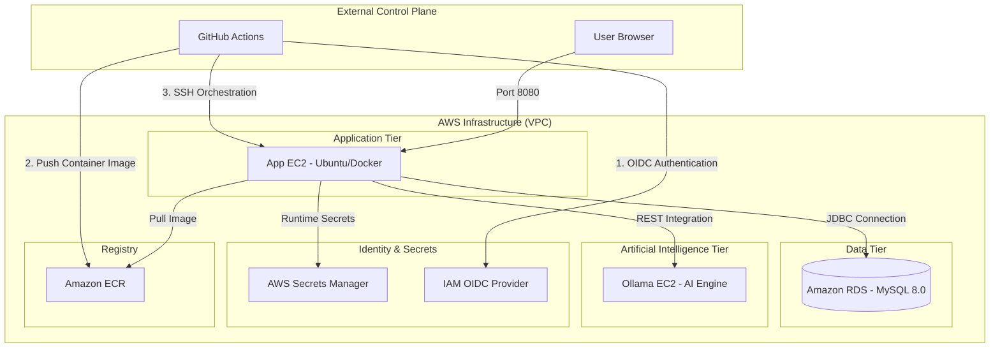

---

## Technology Stack

- **Backend Framework**: Java 21, Spring Boot 3.4.1
- **Security Strategy**: Spring Security, IAM OIDC, Secrets Manager
- **Persistence Layer**: Amazon RDS for MySQL 8.0 (Dev/Test Tier)
- **AI Integration**: Ollama (TinyLlama)
- **DevOps Tooling**: Docker, Docker Compose, GitHub Actions, AWS CLI, jq
- **Infrastructure**: Amazon EC2, Amazon ECR, Amazon VPC

---

## Implementation Phases

### Phase 1: AWS Infrastructure Initialization

1. **Container Registry (ECR)**:
   - Establish a private ECR repository named `devsecops-bankapp`.

      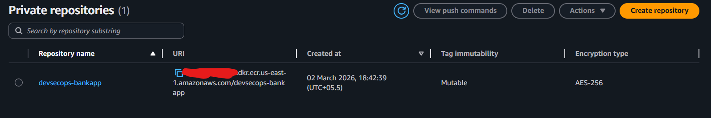

2. **Application Server (EC2)**:
   - Deploy an Ubuntu 22.04 instance.
   - Configure Security Groups to permit Port 22 (Management) and Port 8080 (Service).
   - Create an IAM Instance Profile(IAM EC2 role) containing permissions:
     - `AmazonEC2ContainerRegistryPowerUser`
     - `AWSSecretsManagerClientReadOnlyAccess`

        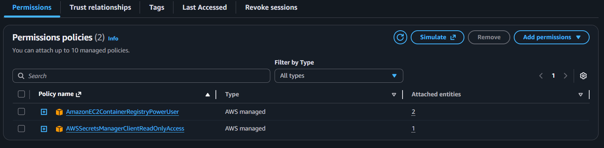

   - Attach it to Application EC2. Select EC2 -> Actions -> Security -> Modify IAM role -> Attach created IAM role.

      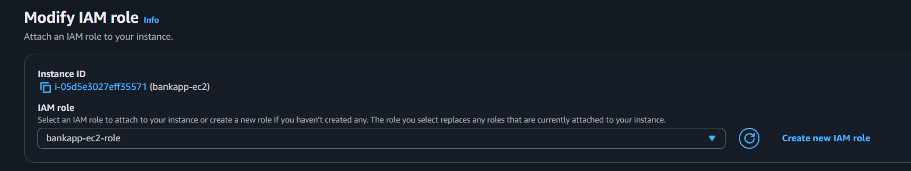

   - Connect EC2 & Execute baseline installation:

     ```bash
     sudo apt update && sudo apt install -y docker.io docker-compose-v2 jq mysql-client
     sudo usermod -aG docker $USER && newgrp docker
     sudo snap install aws-cli --classic
     ```

3. **Database Tier (RDS)**:
   - Provision a MySQL 8.0 instance using the **Dev/Test** template.

     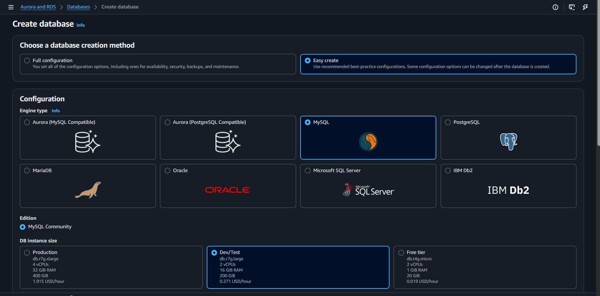

   - Utilize the **Set up EC2 connection** feature to automatically establish connectivity with the Application EC2.

     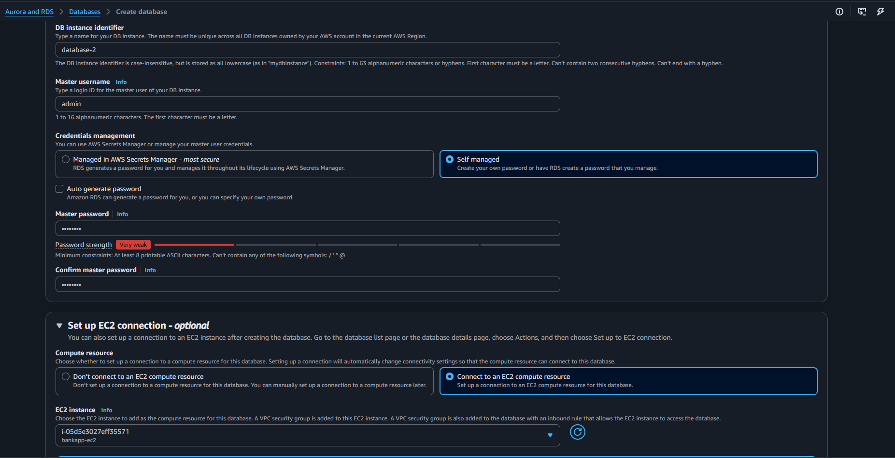

     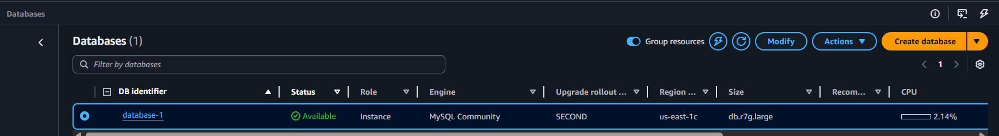

4. **AI Engine Tier (Ollama)**:
   - Deploy a dedicated Ubuntu EC2 instance.
   - Open Inbound Port `11434` from the Application EC2 Security Group.
    
      

   - Automate initialization using the [ollama-setup.sh](scripts/ollama-setup.sh) script via EC2 User Data.
    
      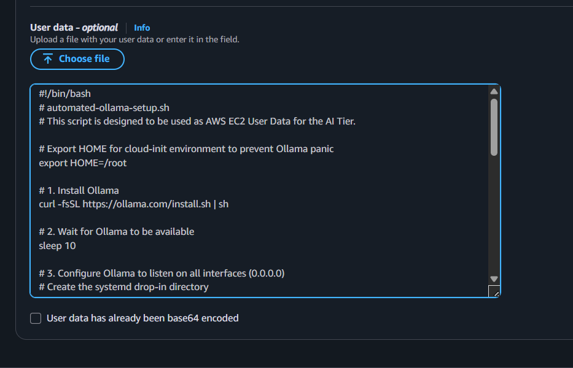

---

### Phase 2: Database and AI Initialization

1. **Schema Provisioning**:
   - Access the RDS instance from the Application EC2:

     ```bash
     mysql -h <RDS-ENDPOINT> -u <USERNAME> -p
     ```

   - Initialize the application database:

     ```sql
     CREATE DATABASE bankappdb;
     EXIT;
     ```

2. **Ollama Verification**:
   - Verify the AI engine is responsive and the model is pulled in `AI engine EC2`:

     ```bash
     ollama list
     ```

---

### Phase 3: Security and Identity Configuration

The deployment pipeline utilizes OpenID Connect (OIDC) for secure, keyless authentication between GitHub and AWS.

1. **IAM Identity Provider**:
   - Provider URL: `https://token.actions.githubusercontent.com`
   - Audience: `sts.amazonaws.com`

      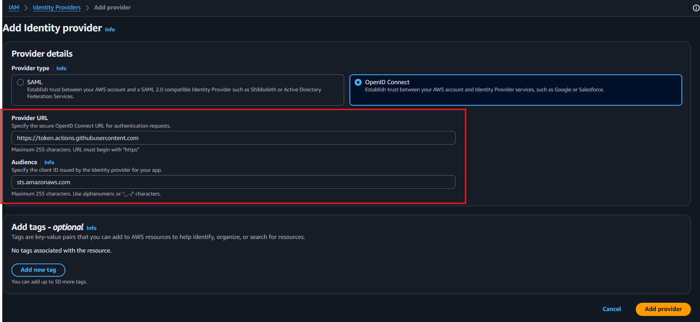

2. **Deployment Role**:
   - click on created `Identity provider`
   - Asign & Create a role named `GitHubActionsRole`.
   - Enter following details:
      - Identity provider: Select created one.
      - Audience: Select created one.
      - GitHub organization: Your GitHub Username or Orgs Name where this repo is located.
      - GitHub repository: Write the Repository name of this project. `(e.g, DevSecOps-Bankapp)`
      - GitHub branch: branch to use for this project `(e.g, devsecops)`
      - Click on `Next`

      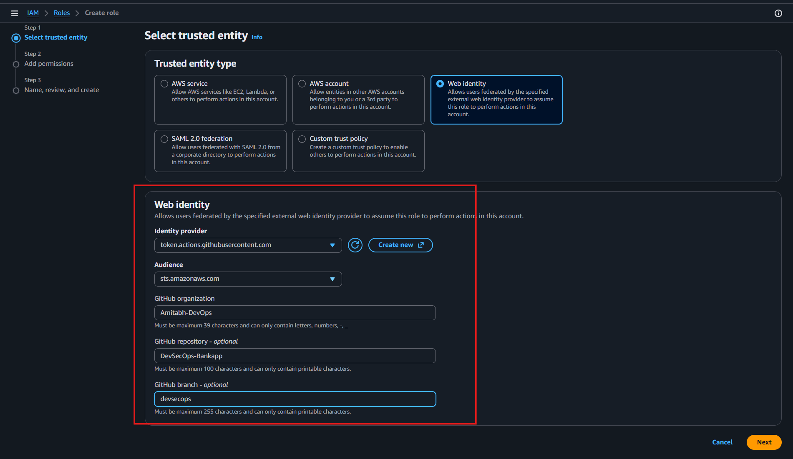

   - Assign `AmazonEC2ContainerRegistryPowerUser` permissions.

      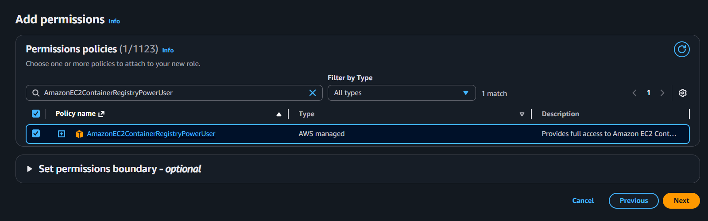

   - Click on `Next`, Enter name of role and `Create Role`.

      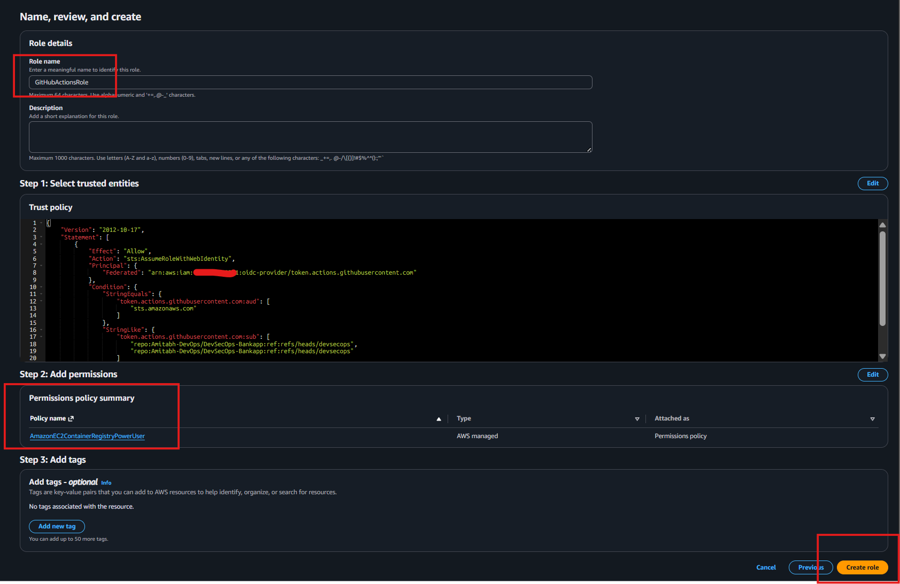

---

### Phase 4: Secrets and Pipeline Configuration

#### 1. AWS Secrets Manager
Create a secret named `bankapp/prod-secrets` with the following key-value pairs:

| Secret Key | Description |
| :--- | :--- |
| `DB_HOST` | The RDS instance endpoint address |
| `DB_PORT` | The database port (standard is `3306`) |
| `DB_NAME` | The application database name (`bankappdb`) |
| `DB_USER` | The administrative username for the RDS instance |
| `DB_PASSWORD` | The administrative password for the RDS instance |
| `OLLAMA_URL` | The private URL for the AI tier (`http://<PRIVATE-IP>:11434`) |

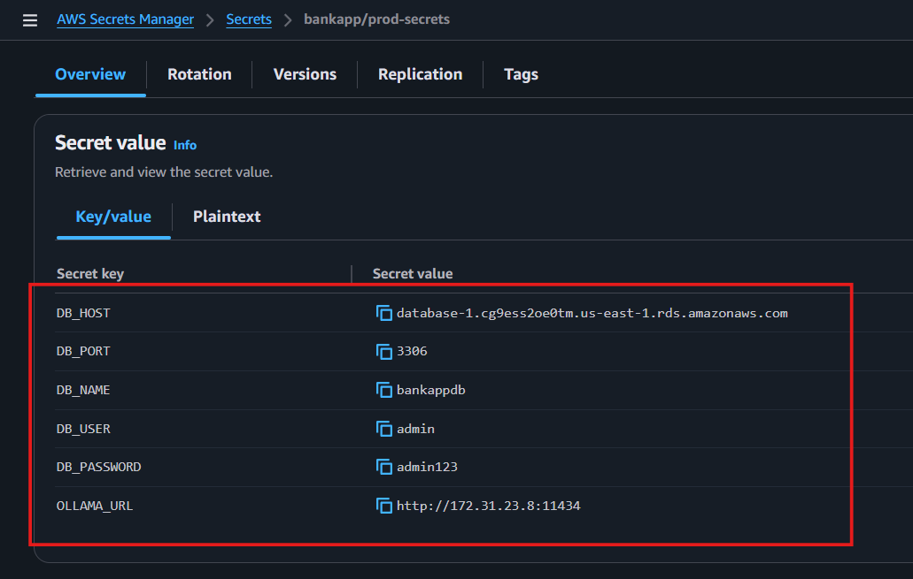

#### 2. GitHub Repository Secrets
Configure the following Action Secrets within your GitHub repository settings:

| Secret Name | Description |
| :--- | :--- |
| `AWS_ROLE_ARN` | The ARN of the `GitHubActionsRole` |
| `AWS_REGION` | The AWS region where resources are deployed |
| `AWS_ACCOUNT_ID` | Your 12-digit AWS account number |
| `ECR_REPOSITORY` | The name of the ECR repository (`devsecops-bankapp`) |
| `EC2_HOST` | The public IP address of the Application EC2 |
| `EC2_USER` | The SSH username (default is `ubuntu`) |
| `EC2_SSH_KEY` | The content of your private SSH key (`.pem` file) |

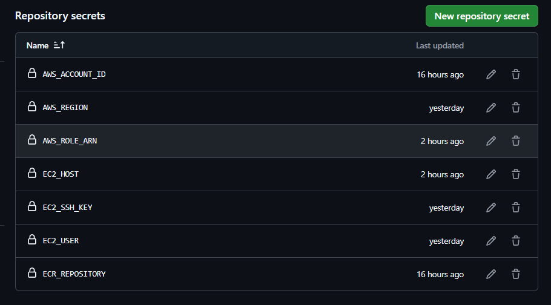

---

## Continuous Integration and Deployment

The [DevSecOps Pipeline](.github/workflows/devsecops.yml) automates the lifecycle:

- **Build**: Compiles the Java application and executes quality checks.
- **Containerization**: Constructs a Docker image and pushes it to ECR via OIDC.
- **Orchestration**:
  - Dynamically retrieves production secrets from AWS Secrets Manager.
  - Generates a localized `.env` file on the Application EC2.
  - Executes `docker compose up -d --build` to safely recreate the application container.

  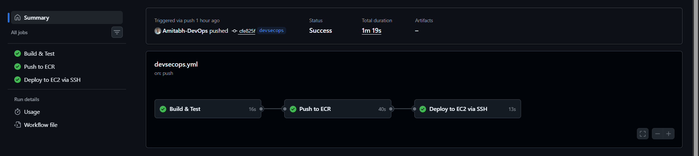

---

## Operational Verification

- **Process Status**: `docker ps`

  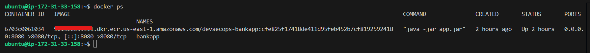

- **Application Working**:

  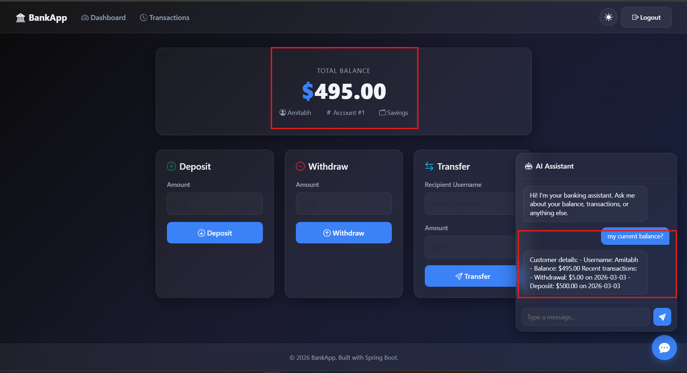

- **Database Connectivity**: 

  ```bash
  mysql -h <RDS-ENDPOINT> -u <USER> -p bankappdb -e "SELECT * FROM accounts;"
  ```

  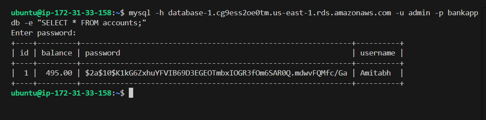

- **Network Validation**: 

  ```bash
  nc -zv <OLLAMA-PRIVATE-IP> 11434
  ```

  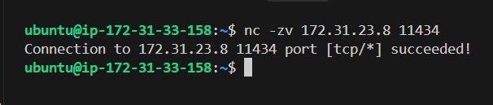

---

<div align="center">

Happy Learning

**TrainWithShubham**  

</div>
