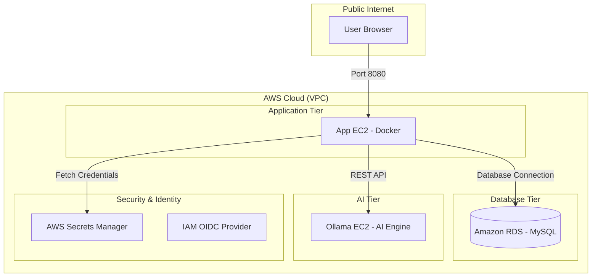

<div align="center">

# 🏦 DevSecOps Banking Application (Master Guide)

A high-performance, containerized banking application built with **Spring Boot 3**, **Java 21**, and **Integrated AI (Ollama)**. This repository provides a complete "Golden Pipeline" setup following modern DevSecOps best practices.

[](https://www.oracle.com/java/technologies/javase/jdk21-archive-downloads.html)
[](https://spring.io/projects/spring-boot)
[](.github/workflows/devsecops.yml)
[](#phase-2-security--identity-iam-oidc)

</div>

---

## 🏗️ Architecture Overview

The system follows a multi-tier, secure architecture deployed on AWS:



---

## 🚀 Setup & Deployment Guide

Follow these phases to implement the project exactly as documented.

### Phase 1: AWS Infrastructure Foundation

1.  **Amazon ECR**: Create a private repository named `devsecops-bankapp`. Save the **Repository URI**.
2.  **Amazon RDS**: Launch a MySQL 8.0 instance (Free Tier).
    - **Database Name**: `bankappdb`
    - **Security**: Allow **Port 3306** from your Application EC2's Security Group.
3.  **App EC2 (Web Tier)**: Launch an Ubuntu 22.04 instance.
    - **Security**: Open **Port 22** (SSH) and **Port 8080** (App).
    - **IAM Profile**: Attach a role with `SecretsManagerReadWrite` and `AmazonEC2ContainerRegistryPowerUser`.
4.  **Ollama EC2 (AI Tier)**: Launch a separate EC2.
    - **Port**: Open **Port 11434** to the App EC2's Security Group.

### Phase 2: Security & Identity (IAM OIDC)

We use **GitHub OIDC** for passwordless AWS authentication.

1.  **Identity Provider**: Add `https://token.actions.githubusercontent.com` with audience `sts.amazonaws.com`.
2.  **IAM Role**: Create a role named `GitHubActionsRole` for Web Identity.
3.  **Trust Policy**:
    ```json
    {
      "Version": "2012-10-17",
      "Statement": [
        {
          "Effect": "Allow",
          "Principal": { "Federated": "arn:aws:iam::<ACCOUNT-ID>:oidc-provider/token.actions.githubusercontent.com" },
          "Action": "sts:AssumeRoleWithWebIdentity",
          "Condition": { "StringLike": { "token.actions.githubusercontent.com:sub": "repo:<ORG>/<REPO>:*" } }
        }
      ]
    }
    ```

### Phase 3: AI Tier Automation

Automate your Ollama server setup using the provided script at [`scripts/ollama-setup.sh`](scripts/ollama-setup.sh).

**Manual Command on Ollama EC2:**
```bash
curl -fsSL https://raw.githubusercontent.com/<OWNER>/<REPO>/main/scripts/ollama-setup.sh | bash
```
*This installs Ollama, configures external network access, and pulls the `tinyllama` model.*

### Phase 4: Secrets Management

Create a secret in **AWS Secrets Manager** named `bankapp/prod-secrets` with:
- `DB_HOST`, `DB_PORT`, `DB_NAME`, `DB_USER`, `DB_PASSWORD`
- `OLLAMA_URL`: `http://<OLLAMA_PRIVATE_IP>:11434`

### Phase 5: GitHub Repository Configuration

Add these **Action Secrets** to your GitHub repository:
- `AWS_ROLE_ARN`, `AWS_REGION`, `AWS_ACCOUNT_ID`
- `ECR_REPOSITORY`, `EC2_HOST`, `EC2_USER`, `EC2_SSH_KEY`

---

## 🛠️ CI/CD Pipeline Logic

The pipeline ([`.github/workflows/devsecops.yml`](.github/workflows/devsecops.yml)) automates everything after a `git push`:

1.  **Build**: Compiles Java 21 code with Maven.
2.  **Containerize**: Builds a Docker image and pushes it to **ECR** using OIDC auth.
3.  **Connect**: SSHes into the App EC2 using `appleboy/ssh-action`.
4.  **Inject**: Environment variables are pulled directly from **AWS Secrets Manager** into a `.env` file on the fly.
5.  **Deploy**: Runs `docker compose pull` and `docker compose up -d` to go live.

---

## 🧪 Verification & Troubleshooting

- **Check App Status**: `curl http://<EC2-IP>:8080/actuator/health`
- **View Container Logs**: `docker logs bankapp`
- **Manual DB Access**:
  ```bash
  mysql -h <RDS-ENDPOINT> -u <USER> -p bankappdb -e "SELECT * FROM accounts;"
  ```
- **OIDC Errors?**: Ensure your IAM Trust Policy `sub` condition matches your GitHub Repository path exactly.

---

<div align="center">

⭐ **TrainWithShubham** ⭐
*Empowering engineers with real-world DevSecOps projects.*
</div>
