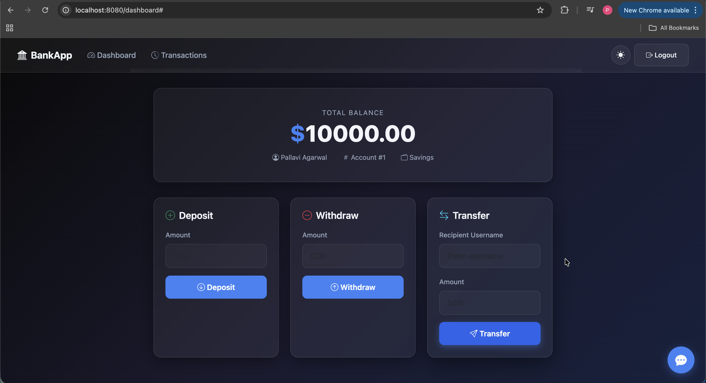

<div align="center">

# 🤖 AI Banking Application

A production-style AI-powered Banking Application built with Spring Boot and integrated with Ollama (Local LLM).

This project was built in **3 progressive stages** — from a simple Docker setup to a fully orchestrated Kubernetes deployment, and finally packaged as a Helm chart.



</div>

---


---

## 🧭 Project Evolution

This project was built progressively, each stage solving real problems from the previous one.

| Stage | Approach | Problem It Solved |
|-------|----------|-------------------|
| Part 1 | Docker + Docker Compose | Run all 3 services together locally |
| Part 2 | Kubernetes (Manual Manifests) | Self-healing, scaling, persistent storage |
| Part 3 | Helm Chart | Managing 9 YAML files as one deployable package |

---

## 🛠️ Technology Stack

- **Backend:** Java 21, Spring Boot 3.4.1
- **Database:** MySQL 8.0
- **AI Integration:** Ollama (TinyLlama)
- **Containerization:** Docker, Docker Compose
- **Orchestration:** Kubernetes (kind)
- **Package Management:** Helm

---

## ⚙️ How It Works

Three services. One application.

```
[Browser] → BankApp (Spring Boot :8080)
                ├── MySQL (database :3306)
                └── Ollama (AI model :11434)
```

- **BankApp** handles all banking logic and routes AI queries to Ollama
- **MySQL** stores user accounts and transaction data
- **Ollama** runs TinyLlama locally and responds to AI-powered queries

---

## 📁 Project Structure

```text
AI-BankApp-docker/
├── src/                          # Spring Boot source code
├── pom.xml
├── Dockerfile
├── mvnw
├── mvnw.cmd
├── LICENSE
├── README.md
├── scripts/
├── screenshots/                  # App screenshots
│
├── setup-k8s/
│   └── kind-config.yml           # kind cluster configuration
│
├── docker-compose.yml            # Part 1 — Docker setup
│
├── k8s/                          # Part 2 — Manual Kubernetes manifests
│   ├── namespace.yml
│   ├── configMap.yml
│   ├── secrets.yml
│   ├── persistentVolume.yml
│   ├── pvc.yml
│   ├── mysql-deployment.yml
│   ├── ollama-deployment.yml
│   ├── bankapp-deployment.yml
│   ├── service.yml
│   └── hpa.yml
│
└── helm/                         # Part 3 — Helm chart
    └── ai-bankapp/
        ├── Chart.yaml
        ├── values.yaml
        ├── charts/
        └── templates/
            ├── _helpers.tpl
            ├── deployment.yaml
            ├── service.yaml
            ├── configMap.yaml
            ├── secret.yaml
            ├── hpa.yaml
            ├── mysql-deployment.yaml
            ├── mysql-service.yaml
            ├── mysql-pvc.yaml
            ├── ollama-deployment.yaml
            ├── ollama-service.yaml
            ├── ollama-pvc.yaml
            ├── serviceaccount.yaml
            └── tests/
```

---

## Part 1: 🐳 Docker + Docker Compose

### 👩‍💻 About This Part

The first version of this project focuses on running all three services together using Docker Compose — without worrying about orchestration, scaling, or persistence.

**Instead of stopping at a working setup, this part focuses on:**
- How multi-container apps communicate over a shared network
- Why a single `docker compose up` is not enough for stateful services
- What breaks when you delete a container

### 🎯 What This Part Demonstrates

- Dockerizing a multi-service Spring Boot application
- Managing service dependencies using Docker Compose
- Container networking — services communicate by name, not IP
- Pulling and running a local LLM (TinyLlama) inside a container

### 🐳 Run with Docker (Recommended)

**Step 1:** Clone the repository
```bash
git clone https://github.com/pallavi2398/AI-Bankapp-docker.git
cd ai-bank-app
```

**Step 2:** Start all services
```bash
docker compose up -d
```

**Step 3:** Pull the AI model (first time only)
```bash
docker exec -it ollama ollama pull tinyllama
```

**Step 4:** Verify containers are running
```bash
docker ps
```

**Step 5:** Access the app
```bash
http://localhost:8080
```

### 💻 Run Locally (Without Docker)

**📌 Prerequisites:** Java 21, Maven, MySQL 8.0

**Step 1:** Create the database
```bash
mysql -u root -p -e "CREATE DATABASE bankappdb;"
```

**Step 2:** Build the application
```bash
./mvnw clean package -DskipTests
```

**Step 3:** Run the application
```bash
MYSQL_HOST=localhost MYSQL_PORT=3306 \
MYSQL_DATABASE=bankappdb \
MYSQL_USER=root MYSQL_PASSWORD=yourpassword \
java -jar target/*.jar
```

### 🧠 Key Engineering Learnings

- Dockerizing a Spring Boot application with multi-stage builds
- Managing multi-container apps with Docker Compose
- Container networking and service discovery by name
- Integrating a local LLM into a backend application

### 🚨 Limitations Identified

- Delete a container → all data is gone (no persistence)
- No self-healing — if a container crashes, it stays down
- Scaling requires manual intervention
- No way to manage config separately from the application

---

## Part 2: ☸️ Kubernetes — Manual Manifests

### 👩‍💻 About This Part

The second stage moves the application to Kubernetes to solve the real problems identified in Part 1 — persistence, self-healing, scaling, and proper configuration management.

**This part focuses on:**
- Why Pods alone are not enough for production workloads
- How Kubernetes solves data loss, crashes, and manual scaling
- Debugging real issues like startup failures and pending pods

### 🎯 What This Part Demonstrates

- **Namespace** — isolated environment for the entire stack
- **ConfigMap** — externalised non-sensitive configuration
- **Secret** — credentials stored separately from application code
- **PersistentVolume + PVC** — data survives Pod restarts
- **Deployments** — self-healing and rolling updates
- **Init Containers** — ensures MySQL and Ollama are ready before BankApp starts
- **Liveness + Readiness Probes** — Kubernetes detects and recovers from failures automatically
- **Resource Requests + Limits** — CPU and memory boundaries for every container
- **HPA** — auto-scales BankApp from 2 to 4 replicas when CPU exceeds 70%
- **Services** — ClusterIP for internal communication, NodePort for external access

### ⚙️ Cluster Setup

**📌 Prerequisites:** kind, kubectl

```bash
# Create the cluster using the provided config
kind create cluster --config setup-k8s/kind-config.yml

# Verify
kubectl get nodes
```

### 🚀 How to Deploy

```bash
kubectl apply -f k8s/namespace.yml
kubectl apply -f k8s/configMap.yml
kubectl apply -f k8s/secrets.yml
kubectl apply -f k8s/persistentVolume.yml
kubectl apply -f k8s/pvc.yml
kubectl apply -f k8s/mysql-deployment.yml
kubectl apply -f k8s/ollama-deployment.yml
kubectl apply -f k8s/bankapp-deployment.yml
kubectl apply -f k8s/service.yml
kubectl apply -f k8s/hpa.yml
```

### ✅ Verify the Deployment

```bash
# See everything running in the namespace
kubectl get all -n bankapp

# Check persistent storage
kubectl get pvc -n bankapp

# Check autoscaler
kubectl get hpa -n bankapp
```

### 🌐 Access the App

```bash
kubectl port-forward svc/bankapp-service 8080:8080 -n bankapp
```

Open `http://localhost:8080`

### 🚨 Real Issue Faced — Startup Failure

BankApp was crashing on startup because it tried to connect to MySQL and Ollama before they were ready.

```bash
# Error seen in logs
kubectl logs bankapp-ai-bankapp-cfc9b7654-2mcrn -n bankapp
# Connection refused: mysql-service:3306
```

**Fix — Init Containers:**

```yaml
initContainers:
  - name: wait-for-mysql
    image: busybox:1.36
    command: ["/bin/sh", "-c", "until nc -z mysql-service 3306; do sleep 2; done"]
  - name: wait-for-ollama
    image: busybox:1.36
    command: ["/bin/sh", "-c", "until nc -z ollama-service 11434; do sleep 2; done"]
```

Zero changes to application code. Init containers run first — the main container only starts after both pass.

### 🔁 Self-Healing Test

```bash
# Delete a BankApp pod — Deployment recreates it automatically
kubectl delete pod <bankapp-pod-name> -n bankapp
kubectl get pods -n bankapp -w

# Delete the MySQL pod — data still exists because of PVC
kubectl delete pod <mysql-pod-name> -n bankapp
kubectl get pods -n bankapp -w
```

### 🧠 Key Engineering Learnings

- Pods are ephemeral — PVCs solve persistence
- "Pod is Running" ≠ "App is healthy" — probes solve this
- Init containers handle dependency ordering without touching application code
- HPA needs `resources.requests.cpu` set — without it TARGETS shows `<unknown>`
- Deployments self-heal; standalone Pods do not

### 🚨 Limitations Identified

- 9 separate YAML files to manage and keep in sync
- Updating one config means editing multiple files
- No easy way to manage different environments (dev/staging/prod)
- No stack-level versioning or rollback

---

## Part 3: ⎈ Helm — Packaged as a Chart

### 👩‍💻 About This Part

The third stage packages the entire Kubernetes setup as a Helm chart — solving the YAML management problem identified in Part 2.

**This part focuses on:**
- Why raw YAML files don't scale as a management strategy
- How Helm templating replaces repeated manual edits
- Stack-level upgrades and rollbacks

### 🎯 What This Part Demonstrates

- Packaging a multi-service Kubernetes app as a single Helm chart
- Using `values.yaml` as the single source of truth for all configuration
- Go templating — `{{ .Values.key }}`, `{{ .Release.Name }}`, `{{ .Chart.Name }}`
- Stack-level upgrade and rollback with full revision history
- `helm template` and `helm lint` for validating before deploying

### ⚙️ What Changed vs Manual Manifests

| Before (Manual) | After (Helm) |
|-----------------|--------------|
| 9 separate YAML files | 1 chart, 1 command |
| Edit multiple files for one config change | Change one value in `values.yaml` |
| No stack-level versioning | Full upgrade and rollback history |
| Copy files to switch environments | Swap values file per environment |

### 📌 Prerequisites

```bash
# Install Helm
brew install helm

# Verify
helm version
```

### 🚀 How to Deploy

```bash
# Create namespace
kubectl create namespace bankapp

# Validate before installing
helm lint helm/ai-bankapp
helm template bankapp helm/ai-bankapp --namespace bankapp

# Install
helm install bankapp helm/ai-bankapp --namespace bankapp

# Watch everything come up
kubectl get all -n bankapp -w
```

### ✅ Verify

```bash
helm list -n bankapp
kubectl get pods -n bankapp
kubectl get pvc -n bankapp
kubectl get hpa -n bankapp
```

### 🌐 Access the App

```bash
kubectl port-forward svc/bankapp-service 8080:8080 -n bankapp
```

Open `http://localhost:8080`

### 🔁 Upgrade and Rollback

```bash
# Upgrade — edit values.yaml or use --set
helm upgrade bankapp helm/ai-bankapp --namespace bankapp --set replicaCount=3

# View full revision history
helm history bankapp -n bankapp

# Rollback to revision 1
helm rollback bankapp 1 -n bankapp
```

### 📊 Lines of YAML Generated

```bash
helm template bankapp helm/ai-bankapp --namespace bankapp | wc -l
# 343 lines — generated correctly, every time
```

### 🗑️ Cleanup

```bash
helm uninstall bankapp -n bankapp
kubectl delete namespace bankapp
```

### 🧠 Key Engineering Learnings

- Helm doesn't replace understanding Kubernetes — it builds on top of it
- `{{ .Values.key }}` pulls from `values.yaml` at install time
- `b64enc` in secret templates means you store plain text in `values.yaml`, Helm handles encoding
- Rollback creates a new revision — history is never overwritten
- `helm template` before `helm install` is the best debugging habit

---

## 🎯 Overall Key Learnings

| Concept | Where It Appeared |
|---------|-------------------|
| Multi-container apps | Part 1 — Docker Compose |
| Container networking | Part 1 — service names as hostnames |
| Data persistence | Part 2 — PV + PVC |
| Self-healing | Part 2 — Deployments + probes |
| Startup dependency management | Part 2 — Init containers |
| Auto-scaling | Part 2 — HPA |
| Config and secrets management | Part 2 — ConfigMap + Secret |
| Stack-level packaging | Part 3 — Helm chart |
| Environment management | Part 3 — values files |
| Upgrade and rollback | Part 3 — Helm history |

---

## 🚀 Future Improvements

- CI/CD pipeline to auto-build and push Docker image on every commit
- Ingress controller to replace NodePort
- Helm chart published to a chart repository
- Monitoring with Prometheus and Grafana
- Namespace-level RBAC policies

---

## 🙌 Acknowledgment

This project is based on an open-source Spring Boot AI Banking Application.
My contributions include Dockerization, Kubernetes orchestration with manual manifests, and Helm chart packaging.

---

**Author**<br>
Pallavi Agarwal<br>
Aspiring DevOps Engineer | Learning in Public